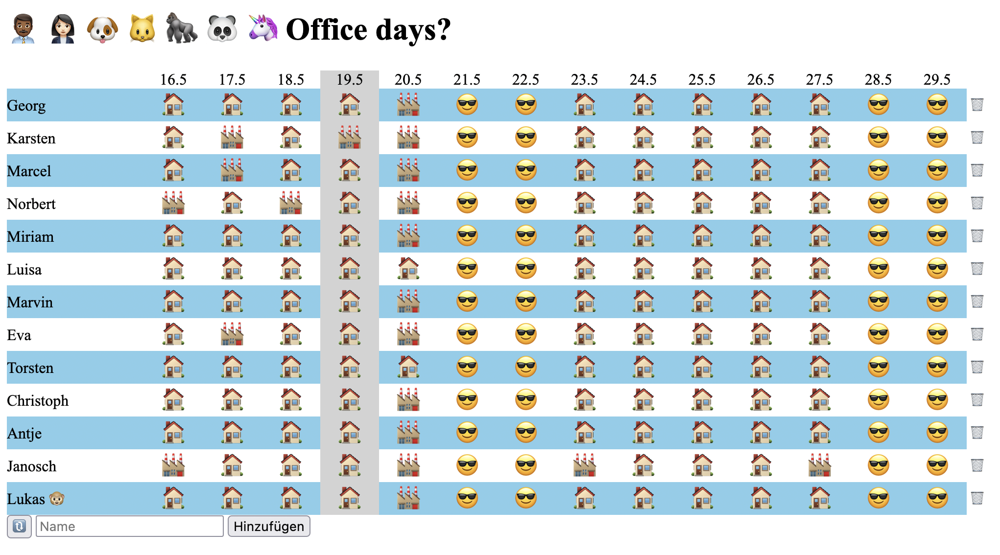

# Office days

A little tool to communicate our office days :)
- everyone can add/delete people and mark the office/home days (no authentication, no checks, just trust 👮)
- toggle office/home by clicking the icons
- weekends are highlighted 😎

# Technical stuff

Svelte Frontend + ASP.NET Backend

## Configure backend
- add environment variable `DataFolder` to the folder where the data should be stored (stored in a simple json file)
  - Possibilities: edit `appsettings.json`, use `dotnet user-secrets`, deployment environment variables, ...
- you can also use a `docker-compose` file to start the backend from the lasted image on docker hub

- the backend caches the app data and write them every x minutes to a json file (see `DataFolder` environment variable)

## Configure frontend
- add environment variable `VITE_BACKEND_SERVER` with the address of the backend server.
- start/deploy svelte project
